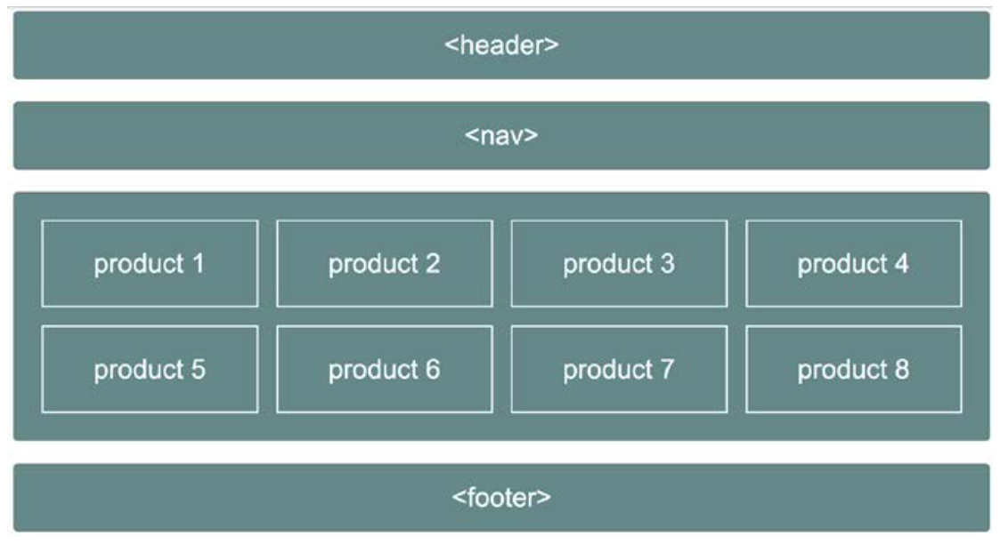

# Full Stack Blockchain dApp Development

# Short Summary
It has been debated in the blockchain space. That the biggest hardle to mass adoption of cryptocurrencies is how users experience it. Currently, this is a fragmented experience. I don't claim to solve all these problems. Although, I do make attempts to show the developer where dApp developers need to make different decisions then they would make in traditional client/server design patterns. Our user interface will comprise of purely HTML5 / CSS3 and TypeScript. 

#Requirements
Some prior knowledge of Web Development basics would be beneficial in following these solutions. There will be provided additional resource material for the user if they wish to further their understanding of the subject.<br>
[W3C HTML / CSS / Javascript Primer](https://www.w3schools.com/html/default.asp) <br>
[TypeScript Tutorial Primer](https://www.typescriptlang.org/docs/handbook/typescript-in-5-minutes.html)

# What is TypeScript and Why should we use it ?

TypeScript is an object-oriented programming language developed and maintained by Microsoft. It's a superset of JavaScript, meaning that any valid `JavaScript` code will also run as expected in `TypeScript`. An important point to understand is that if you just know Javascript you can start using TypeScript as it compiles down to native Javascript.

TypeScript has all of the functionality of JavaScript as well as some additional features. It needs to be compiled to plain JavaScript during runtime, therefore you need a compiler to get back the JS Code.<br>

TypeScript uses static typing, meaning that you can give a type to a variable during declaration. And it's something that can't be done with JavaScript because it's a dynamically typed language – it does not know the data type of a variable until it assigns a value to that variable at runtime.

Static type checking makes TypeScript great because it helps to throw an error at compile-time if the variable is unused or reassigned with a different type annotation. However, the error does not block the code from executing (and the JavaScript code will still be generated).

Static typing is optional in TypeScript. If no type is defined but the variable has a value, TypeScript will infer the value as type. And if the variable has no value, the type will be set to any by default.

# Setting up our TypeScript project

TypeScript needs to compile to plain JavaScript. So we need to use a tool to do the compilation. And to have access to that tool, you need to install TypeScript by running this command on the terminal.

```javascript
 yarn add -g typescript
```

Or use npm:
```javascript
npm install -g typescript
```

Note that here I use the -g flag to install TypeScript globally so that I can access it from anywhere.

By installing TypeScript, we have now access to the compiler, and we can compile our code to JavaScript.

# Configuring TypeScript with tsconfig

`tsconfig` is a JSON file that helps configure `TypeScript`. Having a config file is better since it helps control the behavior of the compiler.

To create the config file, you first need to create a new directory named solution0 and browse into the root of the folder. Then, open it on the terminal or an IDE and run this command to generate a new TypeScript configuration file.

```javascript
tsc --init
```
Once the file is generated, we can now explore it on an IDE.

```javascript
tsconfig.json
```

Once the file is generated, we can now explore it on an IDE.
* `tsconfig.json`

```javascript
{
  "compilerOptions": {
    "module": "commonjs",
    "target": "es5",
    "sourceMap": true
  },
  "exclude": [
    "node_modules"
  ]
}
```

target: it specifies the ECMAScript target version when compiling the TypeScript code. Here, we target es5 to support all browsers, you can change it to ES6, ES3(it's the default if no target is specified), ES2020, etc.

module: it defines the module of the compiled code. The module can be Common JS, ES2015, ES2020, etc.

# TypeScript Types

Types provide a way to enhance code quality, and they also make the code easier to understand since it defines the variable types. They are optional, and help define what a given variable should have as its value. They also allow the compiler to catch errors before runtime.

TypeScript has several types such as number, string, boolean, enum, void, null, undefined, any, never, array, and tuple. We won't see all types in this guide, but keep in mind that they exist.

Now, let's see some examples of basic Types.

# Basic TypeScript Types

```typescript
let foo: string = "test"
let bar: number = 1
let baz: string[] = ["This", "is", "a", "Test"]
```

As you can see here, we have three variables with different types. `foo` expects a string, `bar`, a number, and `baz`, an array of a string. If they receive anything else besides the type declared, an error will be thrown by TypeScript.

You can also declare `baz` like this: `let baz: Array<string> = ["This", "is", "a", "Test"]`.

Now, let's try to reassign one of these variables and see how TypeScript behaves.

Now, let's try to reassign one of these variables and see how TypeScript behaves.

```typescript
let foo: string = "test"
foo = 1
```

```typescript
Type '1' is not assignable to type 'string'
```

TypeScript will throw an error because we have already declared foo to expect a string as value. And this error is caught at compile-time which makes TypeScript great and useful.

But you can also declare variables with an implicit type annotation.

```typescript
let foo = "test"
let bar = 1
let baz = ["This", "is", "a", "Test"]
```

TypeScript will try here to infer as much as it can to give you type safety with less code. It will take the value and define it as a type for the variable. And nothing will change regarding errors.

Let's try to reassign these variables to see what will happen.

```typescript
foo = 7
bar = "updated"
baz = [2, true, "a", 10]
```

TypeScript will catch the errors like before, even if variable types are declared implicitly.

When dealing with an object of several properties, it can be tricky and annoying to define the types. But luckily, TypeScript has something to help you along with that use-case. So, let's dive into TypeScript Interfaces and Type aliases in the next section.

# Interfaces and Type aliases

Interfaces and Type aliases help us define the shape of an object-like data structures. They seem like the same thing regarding their structure, but keep in mind that they are different.

However, the consensus amongst developers is to use interface whenever you can since it's in the default tslint ruleset.

Now, let's create an interface and a type alias in the next section to see them in action.

```typescript
interface ITest {
  id: number;
  name?: string;
}

type TestType = {
  id: number,
  name?: string,
}

function myTest(args: ITest): string {
  if (args.name) {
    return `Hello ${args.name}`
  }
  return "Hello World"
}

myTest({ id: 1 })
```

They have to define the form of given data with TypeScript.

Notice that here, I use an optional field name by adding a question mark (?). It lets us make the property name optional. That means if no value is passed to the property name, it will return undefined as its value.

Next, we use the interface ITest as a type for the argument received by the function myTest. And as with variables, functions can also be defined to return a specific type. And here, the return value must be a string otherwise an error will be thrown by TypeScript.

So far, we have covered all the basic knowledge needed to get started with TypeScript. Now we can start building out our shopping dApp.


# Building a Decentralized Shopping dApp

When building a decetralized dApp. You will spend a good amount of time working on the front end to make sure your new users have the best experience possible. A good place to start is to understand how your interface and user experience should work. We are going to build something that will look something similar to the following.

 <br>

# Creating a Shopping dApp Card

So, let's start by creating three new files in the root of the folder: index.html, style.css, and src/app.ts. And for the configuration of TypeScript, we will use the same tsconfig.json file created earlier.

Now, let's move to the markup part and add some content to the HTML file.

#Markup
* `index.html`

```html
<!DOCTYPE html>
<html lang="en">
  <head>
    <meta charset="UTF-8" />
    <meta name="viewport" content="width=device-width, initial-scale=1.0" />
    <link rel="stylesheet" href="style.css" />
    <title>Shopping dApp</title>
  </head>
  <body>
    <main>
      <h1>Shopping dApp</h1>
      <div id="app"></div>
    </main>
    <script src="public/js/app.js"></script>
  </body>
</html>
```

As you can see we have a relatively simple markup. There are two important things to retain though:

* the id `app` of the `div` tag that will be used to append the content using TypeScript, and

* the `script` tag that points to the `public` folder and to be precise the JavaScript file that TypeScript will create for us during compile time.

Besides, the CSS file is a bit long, so I won't cover it – I don't want to waste your time and do want to stay focused on TypeScript. That said, we can now dive into it and start fetching data from the API.

# Display data using TypeScript

We start the TS part by selecting the id app which is the id of the div tag.

* src/app.ts

```typescript
const container: HTMLElement | any = document.getElementById("app")
const items: number = 100

interface IItem {
  id: number;
  name: string;
  image: string;
  type: string;
}
```

Here, we have a type annotation that has not to be covered yet. This is a Union Type which allows having alternative types for a given variable. That means if container is not of type HTMLElement, TypeScript will check again if the value is equal to the type after the pipe (|) symbol and so forth because you can have multiple types.

Next, we have an interface IItem that defines the contents of a IItem object which will be used next in the function responsible for displaying the content.

# How to Generate Algorand Accounts and Transactions using React and interact with AlgoSigner

## Main Methods

We will be using a few methods from the algosdk to make all of this happen:

1. `generateAccount()` returns a new Algorand address and its corresponding secret key


2. `mnemonicToSecretKey()` takes a mnemonic string and returns the corresponding Algorand address and its secret key


3. `signTransaction()` takes an object and returns a signed blob


4. `sendRawTransaction()` takes an encoded signed transaction and broadcasts it to the network

# Set up your environment

First things first - spin up a dockerized Algorand node using sandbox. There is a full tutorial on how to get setup and started with sandbox. You need a way to talk to Algorand and running a node is the best way to do so. You can also use PureStake API service as a way to connect to the network, however, in this tutorial I will be doing so using sandbox.

Once you’ve downloaded sandbox and have started the node using /sandbox up which bootstraps from TestNet binaries. Get your React App up and running using create-react-app

`create-react-app [APP-NAME]`

Make sure you have the create-react-app environment installed on your machine. This tools makes React development very easy because it sets up and configures your dev environment for you using the latest JS features and optimizes your app for production. I’ve decided to name my app “genacct”, but you can name yours whatever you’d like.

```
genacct/
└── node_modules/
├── public/
├── src/
│   ├── App.css
│   ├── App.js
│   ├── App.test.js
│   ├── index.css
│   ├── index.js
│   ├── logo.svg
│   ├── serviceWorker.js
│   ├── setupTests.js
│   ├── bootstrap.css
│   ├── bootstrap.css.map
│   ├── bootstrap.min.css
│   └── bootstrap.min.css.map
└── package-lock.json
└── package.json
└── README.md
```
This is be what your directory should tree look like at this point.

We are also going to have to install some dependencies to make this app work.

1. React Router Dom
2. Algosdk
3. Bootstrap
4. Jquery
5. Popper.js
6. clipboard-copy

```
npm install --save react-router-dom 
npm install algosdk
npm install bootstrap
npm install jquery
npm install popper.js
npm install clipboard-copy
```

# Craft the React App

Begin by renaming `App.js` to `App.jsx` . JSX is a syntax extension to JavaScript and it describes what the UI should look like. JSX produces React elements that are returned from components and rendered to the DOM.

Next, import algosdk and instantiate the Algorand Client.

Inside of src create a directory called services and a file inside of services called `algorandsdk.js`

```javascript
import algosdk from 'algosdk';

const token = "aaaaaaaaaaaaaaaaaaaaaaaaaaaaaaaaaaaaaaaaaaaaaaaaaaaaaaaaaaaaaaaa"
const server = "http://127.0.0.1";
const port = 4001; // sandbox port

// algod client
const AlgorandClient = new algosdk.Algod(token, server, port);
export default AlgorandClient;
```

The arguments that are being passed in to token server and port should be the same, but if you’d like to find these values for yourself. Enter the sandbox container with the `./sandbox` enter command and cat out the values for `algod.token` and `algod.net`

```
./sandbox enter
Entering /bin/bash session in the sandbox container...
root@9e650578955b:/opt/algorand/node# cat data/algod.token
aaaaaaaaaaaaaaaaaaaaaaaaaaaaaaaaaaaaaaaaaaaaaaaaaaaaaaaaaaaaaaaa
root@9e650578955b:/opt/algorand/node# cat data/algod.net
[::]:4001
```

Now let’s begin to structure the application a bit. Inside of src create the two other directories: assets and components . Create three more directories inside of the components directory called pages `stateful` and `stateless`.

Create a file called `appRouter.jsx` and use the code snippet below as the boilerplate to get started.

```javascript
import * as React from "react";
import { BrowserRouter as Router, Route, Redirect } from "react-router-dom";
import App from "../../App";

const AppRouter = () => {
    return (
      <Router>
        <App>
        </App>
    </Router>
  );
};
export default AppRouter;
```

Go back to the `index.js` file that was created with the create-react-app tool and import the following code.

```javascript
import React from 'react';
import ReactDOM from 'react-dom';
import './index.css';
import "../node_modules/popper.js/dist/popper.min";
import "../node_modules/bootstrap/dist/js/bootstrap.min";
import "../node_modules/bootstrap/dist/css/bootstrap.min.css";
import * as serviceWorker from './serviceWorker';
import AppRouter from "./components/stateless/appRouter";

ReactDOM.render(<AppRouter />, document.getElementById('root'));

// If you want your app to work offline and load faster, you can change
// unregister() to register() below. Note this comes with some pitfalls.
// Learn more about service workers: https://bit.ly/CRA-PWA
serviceWorker.unregister();
```

This will import the popper.js and bootstrap dependencies as well as render elements to the DOM from your App Router. React Router is routing library for React, it immensely simplifies life for both frontend and backend developers. React Router keeps your UI in sync with your URL and introduces a new dynamic, component based approach to routing, as opposed to static routing.

# Components

Now we are ready to build out our components and render them in the appropriate places.

1. Create Account Button Component

It is good practice to break everything up into simple, small and reusable components for debugging and for cleaner development. We will start with the smallest pieces, the foundations of the application, and build our way up. What we want is for the user to be prompted to generate an account or restore an account when they first come to the app, if they haven’t generated one already.
Create your first component inside of the stateless directory called createaccountbutton.jsx and import the following code.

```javascript
import * as React from "react";
import algosdk from "algosdk";
/**
 * This component will generate a new account with a click of generate button.
 * @props createAccount: (keys) => void -> this will get the account keys as arg from props
 */
const CreateAccountButton = props => {
  // this will create a new account and push it to props createAccount
  let generateAccount = () => {
    // generating new account
    let keys = algosdk.generateAccount();

    // calling the props createAccount
    props.createAccount(keys);
  };

  return (
    <button
      type="button"
      className="btn btn-outline-primary col-md-12"
      onClick={generateAccount}
    >
      Generate Account
    </button>
  );
};
export default CreateAccountButton;
```

This component makes use of the `generateAccount();` method from the `algosdk` and will returns an `Algorand` account address and a secret key pair.

2. Restore Account Button Component 
   
We also want to be able to restore or import an account into our app because the user might have a specific account that they want used within the application. To do this, create another file inside of the stateless directory called `restoreaccountbutton.jsx`

```javascript
import * as React from "react";
import algosdk from "algosdk";

/**
 * This component will restore your account given mnemonic from props with a click of restore button.
 * @props mnemonic: string -> get the mnemonic provided to the component
 * @props restoreAccount: (keys) => void -> this will get the account keys as arg from props
 */
const RestoreAccountButton = props => {
  // this will create a new account and push it to props createAccount
  let restoreAccount = () => {
    // generating new account
    var keys = algosdk.mnemonicToSecretKey(props.mnemonic);

    // calling the props createAccount
    props.restoreAccount(keys);
  };

  return (
    <button
      type="button"
      className="btn btn-outline-light col-md-12"
      onClick={restoreAccount}
    >
      Restore Account
    </button>
  );
};
export default RestoreAccountButton;
```

Notice that in this file we are calling the mnemonicToSecretKey() method from the algosdk which takes a 25-word string mnemonic phrase and returns a public private key pair.

3. Create Account Page Component
   
Now that we have all the components we need to create or recover an account, let’s write the Create Account and Restore Account pages. We will then go into routing to these pages from a header component that we will write later on. Create a new file inside of `pages` and call it `createaccountpage.jsx`

```javascript
import * as React from "react";
import algosdk from "algosdk";
import { withRouter, Link } from "react-router-dom";
import CreateAccountButton from "../stateless/createaccountbutton";

/**
 * This component will generate a new account with a click of generate button
 * Also the restore button will redirect you to restore acount page.
 */
const CreateAccountPage = ({ history }) => {
  // this will create a new account and push it to localstorage
  let createAccount = keys => {
    // pushing account address and mnemonic to localstorage
    localStorage.setItem("address", keys.addr);
    localStorage.setItem("mnemonic", algosdk.secretKeyToMnemonic(keys.sk));

    // pushing account to localstorage using json stringify
    let accountList = JSON.parse(localStorage.getItem("accountList")) || [];
    accountList.push({
      address: keys.addr,
      mnemonic: algosdk.secretKeyToMnemonic(keys.sk)
    });
    localStorage.setItem("accountList", JSON.stringify(accountList));

    // redirecting to account page
    history.push("/account");
  };

  return (
    <div className="d-flex justify-content-center">
      <div className="col-md-4">
        <div
          style={{ marginTop: "5em", padding: "4em" }}
          className="rounded-lg shadow border bg-light"
        >
          <div className="form-group mb-4">
            <CreateAccountButton createAccount={createAccount} />
          </div>
          <hr />
          <div className="text-center mt-4">
            <span>
              Already have an account?{" "}
              <Link to="/restore" className="btn btn-outline-secondary ml-2">
                Restore Account
              </Link>
            </span>
          </div>
        </div>
        <div className="text-center text-secondary mt-4">
          Powered by Algorand
        </div>
      </div>
    </div>
  );
};
export default withRouter(CreateAccountPage);
```
This page will create a new account and push it to localstorage.

4. Restore Account Page Component
   
Go ahead and make another file inside of pages and call this one `restoreaccountcomponent.jsx`

```javascript
import * as React from "react";
import { withRouter, Link } from "react-router-dom";
import RestoreAccountButton from "../stateless/restoreaccountbutton";

/**
 * This component will restore your account given mnemonic
 * @state mnemonic: string -> store account mnemonic from textarea
 */
class RestoreAccountPage extends React.Component {
  constructor(props) {
    super(props);
    this.state = {
      mnemonic: ""
    };
  }

  // load mnemonic from user
  loadMnemonic = event => {
    this.setState({ mnemonic: event.target.value });
  };

  // getting the restored account keys from restoreaccountbutton component and pushing it to localstorage
  restoreAccount = keys => {
    console.log(keys);

    // adding to localstorage
    localStorage.setItem("address", keys.addr);
    localStorage.setItem("mnemonic", this.state.mnemonic);

    // pushing account to localstorage account list
    let accountList = JSON.parse(localStorage.getItem("accountList")) || [];
    accountList.push({
      address: keys.addr,
      mnemonic: this.state.mnemonic
    });
    localStorage.setItem("accountList", JSON.stringify(accountList));

    // redirecting to account page
    this.props.history.push("/account");
  };

  render() {
    return (
      <div className="d-flex justify-content-center">
        <div className="col-md-4">
          <div
            style={{ marginTop: "5em", padding: "4em" }}
            className="rounded-lg shadow border bg-secondary text-white"
          >
            <div className="form-group">
              <label>Mnemonic</label>
              <textarea
                rows="4"
                className="form-control"
                id="mnemonic"
                placeholder="write your mnemonic"
                value={this.state.mnemonic}
                onChange={this.loadMnemonic}
              />
            </div>
            <div className="form-group mb-4">
              <RestoreAccountButton
                restoreAccount={this.restoreAccount}
                mnemonic={this.state.mnemonic}
              />
            </div>
            <hr className="bg-white" />
            <div className="text-center mt-4">
              <span>
                Don't have an account?{" "}
                <Link to="/create" className="btn btn-outline-light ml-2">
                  Create Account
                </Link>
              </span>
            </div>
          </div>
          <div className="text-center text-secondary mt-4">
            Powered by Algorand
          </div>
        </div>
      </div>
    );
  }
}
export default withRouter(RestoreAccountPage);
```

This page will get the restored account keys from the `restoreaccountbutton.jsx` and push it to localstorage.

# Transaction Construction and Broadcasting

5. Suggested Fee Component

Now let’s build out the transaction page and transaction and suggested fee components. Blockchain development requires a few added steps from what full-stack developers might be used to. Besides checking the block explorers in between transactions and using the dispensers to get some funds for testing, you also need to include fees as an argument when constructing transactions. However, transaction fees are dynamic because they are typically dependent on several other factors in a blockchain network. This component simplifies that step and returns the suggested fee parameter from the Algorand client that you instantiated in algorandsdk.js . Create a file called `suggestedfeecomponent` inside of the `component/stateful` directory.

```javascript
import * as React from "react";
import AlgorandClient from "../../services/algorandsdk";

/**
 * This component will show you suggested fee.
 * @state suggestedFee: number -> store suggessted fee from the sdk
 */
export default class SuggestedFeeComponent extends React.Component {
  constructor(props) {
    super(props);
    this.state = {
      suggestedFee: 0
    };
  }
  componentDidMount = async () => {
    // getting the suggested fee
    let suggestedFee = await AlgorandClient.suggestedFee();
    this.setState({ suggestedFee: suggestedFee.fee * 1000 });
  };
  render() {
    return (
      <div>
        <label>Fees: </label>
        <span className="ml-2">{this.state.suggestedFee} microAlgos</span>
      </div>
    );
  }
}
```

This component will show you the suggested fee and we will render this inside of the next component we will build out.

6. Transaction Component
   
Create a file inside of `stateful` and call it `transactioncomponent.jsx`

```javascript
import * as React from "react";
import algosdk from "algosdk";
import $ from "jquery";
import AlgorandClient from "../../services/algorandsdk";
import copy from "clipboard-copy";
import SuggestedFeeComponent from "./suggestedfeecomponent";

/**
 * This component is used to send online transaction and can save transaction to be signed offline using a account mnemonic given as a prop
 * @props mnemonic: string -> account mnemonic
 *
 * @state addressTo: {value: string, isValid: boolean, message: string} -> store address to send payment
 * @state amount: number -> store the amount to send
 * @state note: string -> store the note
 * @state txnId: string -> store transaction id after the transaction is complete
 * @state errorMessage: string -> store error message if there is any error during transaction
 */
export default class TestTransactionComponent extends React.Component {
  constructor(props) {
    super(props);
    this.state = {
      addressTo: {
        value: "",
        isValid: true,
        message: "Please choose an address."
      },
      amount: "",
      note: "",
      txnId: "",
      errorMessage: ""
    };
  }

  copyToClipboard = () => {
    copy(this.state.txnId);
  };

  // load address to send payment
  loadAddressTo = event => {
    this.setState({
      addressTo: {
        value: event.target.value,
        isValid: true,
        message: "Please choose an address."
      }
    });
  };

  // load amount to send
  loadAmount = event => {
    this.setState({
      amount: event.target.value
    });
  };

  // load note to send
  loadNote = event => {
    this.setState({
      note: event.target.value
    });
  };

  componentDidMount() {
    $('[data-toggle="tooltip"]').tooltip();
  }

  componentDidUpdate() {
    $('[data-toggle="tooltip"]').tooltip();
  }

  // check balance in the account
  checkBalance = async account => {
    let balance = (await AlgorandClient.accountInformation(account)).amount;
    console.log(balance + " " + account);
    return balance === 0;
  };

  // validating the sender account and also sending the transaction
  sendTransaction = async () => {
    let mnemonic = this.props.mnemonic;
    let recoveredAccount = algosdk.mnemonicToSecretKey(mnemonic);
    let hasBalance = await this.checkBalance(recoveredAccount.addr);

    if (this.state.addressTo.value === "") {
      this.setState({
        addressTo: {
          value: "",
          isValid: false,
          message: "Please choose an address."
        }
      });
    } else if (!algosdk.isValidAddress(this.state.addressTo.value)) {
      this.setState({
        addressTo: {
          value: "",
          isValid: false,
          message: "Please choose a valid address."
        }
      });
    } else if (hasBalance) {
      alert(recoveredAccount + " does not have sufficient balance...");
    } else {
      this.startTransaction(recoveredAccount).catch(e => {
        console.log(e);
      });
    }
  };

  // starting transaction here with the account from
  startTransaction = async recoveredAccount => {
    //Get the relevant params from the algod
    try {
      let params = await AlgorandClient.getTransactionParams();
      let endRound = params.lastRound + parseInt(1000);

      //create a transaction
      let txn = {
        from: recoveredAccount.addr,
        to: this.state.addressTo.value,
        fee: params.fee,
        amount: Number.parseInt(this.state.amount),
        firstRound: params.lastRound,
        lastRound: endRound,
        genesisID: params.genesisID,
        genesisHash: params.genesishashb64,
        note: algosdk.encodeObj(this.state.note)
      };

      // console.log(txn.amount);

      //sign the transaction
      let signedTxn = algosdk.signTransaction(txn, recoveredAccount.sk);

      // sending the transaction
      AlgorandClient.sendRawTransaction(signedTxn.blob)
        .then(tx => {
          console.log(tx);
          this.setState({
            txnId: tx.txId,
            addressTo: {
              value: "",
              isValid: true,
              message: "Please choose an address."
            },
            amount: 0,
            note: ""
          });
        })
        .catch(err => {
          console.log(err);
          // setting the error text to state
          this.setState({ errorMessage: err.text });
        });
    } catch (e) {
      console.log(e);
    }
  };

  signTransactionOffline = async () => {
    if (this.state.addressTo.value === "") {
      this.setState({
        addressTo: {
          value: "",
          isValid: false,
          message: "Please choose an address."
        }
      });
    } else if (!algosdk.isValidAddress(this.state.addressTo.value)) {
      this.setState({
        addressTo: {
          value: "",
          isValid: false,
          message: "Please choose a valid address."
        }
      });
    } else {
      let mnemonic = this.props.mnemonic;
      let recoveredAccount = algosdk.mnemonicToSecretKey(mnemonic);
      try {
        let params = await AlgorandClient.getTransactionParams();
        let endRound = params.lastRound + parseInt(1000);

        //create a transaction
        let txn = {
          from: recoveredAccount.addr,
          to: this.state.addressTo.value,
          fee: params.fee,
          amount: Number.parseInt(this.state.amount),
          firstRound: params.lastRound,
          lastRound: endRound,
          genesisID: params.genesisID,
          genesisHash: params.genesishashb64,
          note: algosdk.encodeObj(this.state.note)
        };
        this.downloadTxnFile(txn);
      } catch (e) {
        console.log(e);
      }
    }
  };

  downloadTxnFile = txn => {
    const element = document.createElement("a");
    const file = new Blob([JSON.stringify(txn)], {
      type: "application/json"
    });
    element.href = URL.createObjectURL(file);
    element.download = "txn.json";
    document.body.appendChild(element); // Required for this to work in FireFox
    element.click();
  };

  render() {
    return (
      <div>
        <div
          style={{ padding: "4em" }}
          className="rounded-lg shadow border bg-light p-4"
        >
          <div className="form-group text-center">
            <h3>Send Transaction</h3>
          </div>
          <div className="form-group">
            <label>Address To</label>
            <input
              type="text"
              className={
                "form-control " +
                (this.state.addressTo.isValid ? null : "is-invalid")
              }
              id="addressTo"
              aria-describedby="adressToHelp"
              placeholder="Enter address"
              value={this.state.addressTo.value}
              onChange={this.loadAddressTo}
            />
            <div className="invalid-feedback">
              {this.state.addressTo.message}
            </div>
          </div>
          <div className="form-group">
            <label>Amount</label>
            <input
              type="number"
              className="form-control"
              id="amount"
              placeholder="0 (in microAlgos)"
              value={this.state.amount}
              onChange={this.loadAmount}
            />
          </div>
          <div className="form-group">
            <label>Note</label>
            <textarea
              rows="3"
              className="form-control"
              id="note"
              placeholder="write note"
              value={this.state.note}
              onChange={this.loadNote}
            />
          </div>

          <div className="form-group">
            <SuggestedFeeComponent />
          </div>
          <div className="d-flex justify-content-around">
            <button
              type="button"
              className="btn btn-dark px-4 mt-2"
              onClick={this.sendTransaction}
            >
              Send
            </button>
            <button
              type="button"
              className="btn btn-dark px-4 mt-2"
              onClick={this.signTransactionOffline}
            >
              Sign Offline
            </button>
          </div>
        </div>
        {this.state.txnId !== "" ? (
          <div className="rounded-lg shadow border bg-light p-4 mt-3">
            <div className="text-success font-weight-bold">
              Transaction Sent
            </div>
            <div className="text-secondary">
              <span className="font-weight-bold">txnId: </span>
              <span
                data-toggle="tooltip"
                data-placement="bottom"
                data-html="true"
                title={
                  "<div>Copy to clipboard</div><div>" +
                  this.state.txnId +
                  "</div>"
                }
                onClick={this.copyToClipboard}
              >
                {this.state.txnId.substr(0, 10)}...
                {this.state.txnId.substr(-4, 4)}
              </span>
            </div>
          </div>
        ) : null}
        {this.state.errorMessage !== "" ? (
          <div className="rounded-lg shadow border bg-light p-4 my-3">
            <div className="text-danger font-weight-bold">Error</div>
            <div className="text-secondary">
              <span className="font-weight-bold">message: </span>
              <span>{this.state.errorMessage}</span>
            </div>
          </div>
        ) : null}
      </div>
    );
  }
}
```

This component can be used to send online transaction and can save transaction to be signed offline using an account mnemonic given as a prop

Notice that in this component, we are recovering the account by calling the `algosdk.mnemonicToSecretKey()` method and passing in the mnemonic as a prop in the `sendtransaction()` method.

```javascript
sendTransaction = async () => {
let mnemonic = this.props.mnemonic;
let recoveredAccount = algosdk.mnemonicToSecretKey(mnemonic);
```

We are constructing the transaction (txn) object from the recoveredAccount and passing in the address as the first argument.

```javascript
let txn = {
   from: recoveredAccount.addr,
   to: this.state.addressTo.value,
   fee: params.fee,
   amount: Number.parseInt(this.state.amount),
   firstRound: params.lastRound,
   lastRound: endRound,
   genesisID: params.genesisID,
   genesisHash: params.genesishashb64,
   note: algosdk.encodeObj(this.state.note)
};
```

The transaction is signed using signTransaction() which accepts the txn as the first argument and the secret key of the from account address.

`let signedTxn = algosdk.signTransaction(txn, recoveredAccount.sk);`

And finally, we are broadcasting the signed transaction to the network using the `sendRawTransaction()` method that accepts an encoded signed txn blob.

7. Transaction Page Component

```javascript
import * as React from "react";
import TransactionComponent from "../stateful/transactioncomponent";

/**
 * This component contain transaction components.
 */
const TransactionPage = () => {
  return (
    <div className="container-fluid row">
      <div className="col-md-6 d-flex justify-content-center">
        <div style={{ marginTop: "5em" }} className="col-md-8">
          <TransactionComponent mnemonic={localStorage.getItem("mnemonic")} />
        </div>
      </div>
    </div>
  );
};
export default TransactionPage;
```

This component simply renders the Transaction Component that we built out in the previous step.

# Final Components — Transaction Page

The last few component steps involve the accounts page. Once a user generates or recovers an account, they should be routed to a homepage of sorts that list all the accounts they’ve generated or recovered and has a navbar at the top to switch to other features (like creating a transaction).

8. Account Detail Component
   
Create a file inside of stateless and call it accountdetailcomponent.jsx this is where we will be rendering a list of different available accounts from the accounts page as well as the option to generate a new account or recover an account.
   
```javascript
import * as React from "react";
import algosicon from "../../assets/images/react-algo-logo.jpg";
import copy from "clipboard-copy";
import { Route } from "react-router-dom";

/**
 * This component will show account details and account transaction list for the address also can change address
 * @props balace: number -> account balance
 * @props address: string -> account address
 * @props mnemonic: string -> account mnemonic
 * @props accountList: Array -> list of account created
 * @props changeAccount: (account) => void -> send account to be changed
 */
const AccountDetailComponent = props => {
  // Download mnemonic file
  let downloadMnemonicFile = () => {
    const element = document.createElement("a");
    const file = new Blob([props.mnemonic], {
      type: "text/plain"
    });
    element.href = URL.createObjectURL(file);
    element.download = "mnemonic.txt";
    document.body.appendChild(element); // Required for this to work in FireFox
    element.click();
  };

  // copy to clipboard
  let copyToClipboard = () => {
    copy(props.address);
  };

  return (
    <div className="rounded-lg shadow border bg-light text-center p-4">
      <div className="d-flex justify-content-between align-items-center">
        <div></div>
        <div>
          <h4>Account</h4>
          <span
            className="badge badge-secondary"
            data-toggle="tooltip"
            data-placement="bottom"
            data-html="true"
            title={
              "<div>Copy to clipboard</div><div>" + props.address + "</div>"
            }
            onClick={copyToClipboard}
          >
            {props.address.substr(0, 4)}...
            {props.address.substr(-4, 4)}
          </span>
        </div>
        <div>
          <button
            className="btn btn-secondary dropdown-toggle"
            type="button"
            id="dropdownMenu2"
            data-toggle="dropdown"
            aria-haspopup="true"
            aria-expanded="false"
          ></button>
          <div
            className="dropdown-menu dropdown-menu-right"
            aria-labelledby="dropdownMenu2"
          >
            <span className="dropdown-item disabled">My Accounts</span>
            <div className="dropdown-divider"></div>
            {props.accountList.map((account, index) => (
              <button
                className="dropdown-item"
                type="button"
                key={account.address}
                onClick={e => {
                  props.changeAccount(account);
                }}
              >
                <div className="font-weight-bold">Account {index + 1}</div>
                <span className="badge badge-secondary">
                  {account.address.substr(0, 4)}...
                  {account.address.substr(-4, 4)}
                </span>
              </button>
            ))}

            <div className="dropdown-divider"></div>
            <Route
              render={({ history }) => (
                <button
                  className="dropdown-item"
                  type="button"
                  onClick={() => {
                    history.push("/create");
                  }}
                >
                  Create Account
                </button>
              )}
            />
            <Route
              render={({ history }) => (
                <button
                  className="dropdown-item"
                  type="button"
                  onClick={() => {
                    history.push("/restore");
                  }}
                >
                  Restore Account
                </button>
              )}
            />
          </div>
        </div>
      </div>
      <hr />
      <div className="mt-5">
        
        <h2 className="mt-4">{props.balance} ALGOS</h2>
      </div>
      <div className="mt-5 text-left px-3">
        <div className="d-flex justify-content-between">
          <h4>Mnemonic</h4>
          <div>
            <span
              className="badge badge-primary text-white p-2"
              style={{ fontSize: 16 }}
              onClick={downloadMnemonicFile}
            >
              save
            </span>
          </div>
        </div>
        <div className="mt-2">
          {props.mnemonic.split(" ").map((term, index) => (
            <span className="badge badge-info m-1" key={index}>
              {term.trim()}
            </span>
          ))}
        </div>
      </div>
    </div>
  );
};

export default AccountDetailComponent;
```

This component will allow the user to switch between accounts. You will be rendering an image in this component that will ultimately display in the `accountpage.jsx` . Create a directory inside of assets called images and drag a small Algorand image from google of your choice, this will display in the `accountdetailcomponent.jsx` . You can call this image whatever you’d like.

9. Account Component

Now create a file inside of `stateful` called `accountcomponent.jsx`

```javascript
import * as React from "react";
import AccountDetailComponent from "../stateless/accountdetailcomponent";
import $ from "jquery";
import AlgorandClient from "../../services/algorandsdk";

/**
 * This component will show account details and provides helper methods to changeAccount and getAccountBalance
 * @props address: string -> account address
 * @props mnemonic: string -> account mnemonic
 * @props accountList: Array -> list of account created
 * @props changeAccount: (account) => void -> send account to be changed
 */
class AccountComponent extends React.Component {
  constructor(props) {
    super(props);
    // initial state
    this.state = {
      balance: 0,
      transactions: [],
      transactionLoaded: false
    };
  }

  componentDidMount = async () => {
    // get address from state
    let addr = this.props.address;

    this.getAccountBalance(addr);

    this.getAccountTransaction(addr);

    // for tooltip
    $('[data-toggle="tooltip"]').tooltip();
  };

  componentDidUpdate() {
    $('[data-toggle="tooltip"]').tooltip();
  }

  /**
   * Change account details and account transaction.
   *
   * @param {{address: string, mnemonic: string}} account
   */
  changeAccount = account => {
    this.props.changeAccount(account);
    console.log(account);
    this.setState({
      balance: 0,
      transactions: [],
      transactionLoaded: false
    });
    this.getAccountBalance(account.address);
    this.getAccountTransaction(account.address);
  };

  /**
   * Get account balance
   *
   * @param {{address: string}} addr
   */
  getAccountBalance = async addr => {
    // get account information
    let accountDet = await AlgorandClient.accountInformation(addr);
    // setting balance to state
    console.log(accountDet);
    this.setState({
      balance: accountDet.amount / 1000000
    });
  };

  /**
   * Get account transactions
   *
   * @param {{address: string}} addr
   */
  getAccountTransaction = async addr => {
    // get transaction params
    let params = await AlgorandClient.getTransactionParams();

    //get all transactions for an address for the last 1000 rounds
    let txts = await AlgorandClient.transactionByAddress(
      addr,
      params.lastRound - 1000,
      params.lastRound
    );

    // setting transaction list and transactionLoaded to true
    this.setState({
      transactions: txts.transactions === undefined ? [] : txts.transactions,
      transactionLoaded: true
    });
  };

  render() {
    return (
      <div className="container-fluid">
        <div className="row">
          <div className="col-md-5 p-3">
            <AccountDetailComponent
              balance={this.state.balance}
              address={this.props.address}
              mnemonic={this.props.mnemonic}
              accountList={this.props.accountList}
              changeAccount={this.changeAccount}
            />
          </div>
        </div>
      </div>
    );
  }
}
export default AccountComponent;
```

This component will show account details and provides helper methods to `changeAccount`, `getAccountBalance` and `getAccountTransaction`.

10. Account Page Component

The final component that we need to complete this version of the app is an account page component. So go ahead and create a `accountpage.jsx` file inside of your `pages` directory and import the following code.

```javascript
import * as React from "react";
import AccountComponent from "../stateful/accountcomponent";

/**
 * This component contains the account component
 *
 * @state address: string -> store account address from the localstorage
 * @state mnemonic: string -> store account mnemonic from the localstorage
 * @state accountList: list of accounts  -> store the list of accounts from the localstorage
 */
class AccountPage extends React.Component {
  constructor(props) {
    super(props);
    this.state = {
      address: localStorage.getItem("address"),
      mnemonic: localStorage.getItem("mnemonic"),
      accountList: localStorage.getItem("accountList")
    };
  }
  changeAccount = account => {
    console.log(account.address);
    localStorage.setItem("address", account.address);
    localStorage.setItem("mnemonic", account.mnemonic);
    this.setState({
      address: localStorage.getItem("address"),
      mnemonic: localStorage.getItem("mnemonic"),
      accountList: localStorage.getItem("accountList")
    });
  };
  render() {
    return (
      <AccountComponent
        address={this.state.address}
        mnemonic={this.state.mnemonic}
        accountList={JSON.parse(this.state.accountList) || []}
        changeAccount={this.changeAccount}
      />
    );
  }
}
export default AccountPage;
```

# Routing and Header Component

We have finished building our components!

Now let’s step back into `appRouter.jsx` and start importing the components and pages that you just wrote.

```javascript
import * as React from "react";
import { BrowserRouter as Router, Route, Redirect } from "react-router-dom";
import App from "../../App";
import CreateAccountPage from "../pages/createaccountpage";
import RestoreAccountPage from "../pages/restoreaccountcomponent";
import AccountPage from "../pages/accountpage";
import TransactionPage from "../pages/transactionpage"

const AppRouter = () => {
    return (
      <Router>
        <App>
            <Route path="/create" component={CreateAccountPage} />
            <Route path="/restore" component={RestoreAccountPage} />
            <Route path="/account" component={AccountPage} />
            <Route path="/transaction" component={TransactionPage}/>
            <Route
                exact
                path="/"
                render={() =>
                    localStorage.getItem("address") !== null ? (
                    <Redirect to="/account" />
                    ) : (
                    <Redirect to="/create" />
                    )
                }
            />
        </App>
    </Router>
  );
};
export default AppRouter;
```

Notice that we use the exact param which is useful for our purposes as it returns the routes for /account if there is an address cached in localstorage or to /create, which renders our Create Account Page component. React uses partial matching for routes, so the exact param disables the partial matching and makes sure that it only returns the route if the path is an EXACT match to the current url.
The final component we need to write before rendering our complete application is the header to navigate from page to page.

11. Header Component
    
Create a file called `headercomponent.jsx` inside of `stateless`

```javascript
import * as React from "react";
import { Link } from "react-router-dom";

const Header = props => {
  return (
    <div>
      <nav className="navbar navbar-expand-lg navbar-dark bg-dark">
        <div className="container">
          <Link className="navbar-brand" to="/">
            Algorand React
          </Link>
          <button
            className="navbar-toggler"
            type="button"
            data-toggle="collapse"
            data-target="#navbarNavDropdown"
            aria-controls="navbarNavDropdown"
            aria-expanded="false"
            aria-label="Toggle navigation"
          >
            <span className="navbar-toggler-icon" />
          </button>
          <div id="navbarNavDropdown" className="navbar-collapse collapse">
            <ul className="navbar-nav mr-auto">
              <li className="nav-item">
                <Link className="nav-link" to="/account">
                  Account
                </Link>
              </li>
              <li className="nav-item">
                <Link className="nav-link" to="/transaction">
                  Transaction
                </Link>
              </li>
            </ul>
          </div>
        </div>
      </nav>
    </div>
  );
};

export default Header;
```

In this header component we are only rendering the two pages who’s routes were defined in the App Router Account Page Component ( /account) and Transaction Page Component ( /transaction).

To wrap this whole things together, go into your `App.jsx` and import the following code

```javascript
import React from "react";
import Header from "./components/stateless/headercomponent";

function App(props) {
  return (
    <div className="App">
      <Header />
      {props.children}
    </div>
  );
}

export default App;
```

Now, in your editor console or back in terminal, run `npm start` and your app should be rendering nicely on localhost:3000 !


